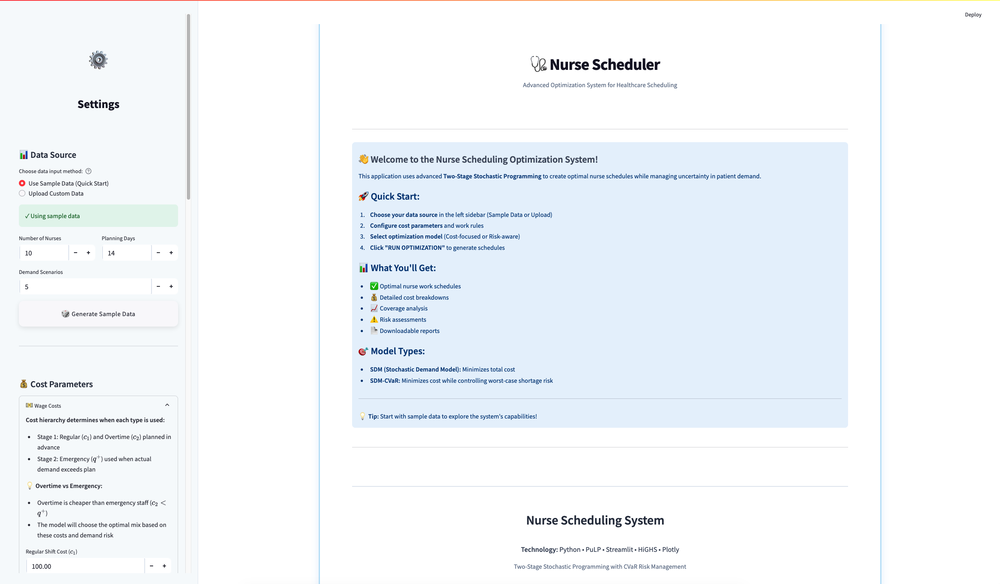

<div align="center">

[](https://www.python.org/downloads/)
[](LICENSE)
[](https://streamlit.io)
[](https://coin-or.github.io/pulp/)
[](https://www.gurobi.com/)
[](https://highs.dev/)

</div>

<br>

<div align="center">
  
</div>

<br>

# FROST-NS

**Fatigue-Aware Risk Optimization for Stochastic Task Allocation in Nurse Scheduling**

An open-source mathematical optimization framework designed to address the complex challenge of healthcare staffing. FROST-NS provides a rigorous computational approach to balancing financial constraints, stochastic patient demand, and workforce fatigue.

---

## Overview

Hospital administrators must finalize monthly staffing rosters under significant uncertainty regarding daily patient volume. 
* Over-scheduling results in an inefficient allocation of financial resources.
* Under-scheduling necessitates the reliance on expensive emergency agency personnel.
* Over-utilizing permanent staff to cover operational gaps increases schedule-based fatigue, which correlates with diminished quality of care.

**FROST-NS** addresses these competing objectives using an advanced operations research framework: **Two-Stage Stochastic Mixed-Integer Linear Programming (MILP)** integrated with **Conditional Value-at-Risk (CVaR)**.

---

## Core Methodological Contributions

1. **Two-Stage Stochastic Optimization**
   * **Stage 1 (Anticipatory Allocation):** Assigns permanent nurses to Regular ($sr$) and Overtime ($so$) shifts prior to the realization of demand.
   * **Stage 2 (Recourse Allocation):** Dynamically allocates Emergency Staff ($\alpha$) and cancels shifts ($\beta$) across a distribution of simulated future scenarios (e.g., standard fluctuations vs. epidemiological outbreaks).

2. **Schedule-Based Fatigue Modeling (McCormick Envelopes)**
   * FROST-NS models cumulative fatigue mathematically, treating exhaustion and recovery as dynamic variables across consecutive days.
   * To maintain computational efficiency within a linear solver, the system utilizes **McCormick Envelopes** to linearize biological decay rates. The formulation establishes a strict upper bound on allowable fatigue, mathematically preventing assignments that would violate occupational health thresholds.

3. **Tail-Risk Control via CVaR**
   * Optimizing for expected value (the average scenario) leaves healthcare facilities vulnerable to extreme operational shocks. 
   * FROST-NS utilizes the **Rockafellar-Uryasev formulation** for CVaR to isolate the worst 5% of simulated scenarios, applying a strict limit on the maximum allowable operational deficit during extreme demand spikes.

---

## Repository Architecture

The architecture is cleanly decoupled into mathematical modeling, result extraction, and interface rendering:

```text
/NSS/
├── core/                  
│   ├── _model_core.py     # Primary MILP engine (PuLP implementation)
│   ├── scheduler.py       # Extracts binary solver variables into Pandas DataFrames
│   ├── validator.py       # Data integrity layer 
│   └── solver_config.py   # Interface to industrial solvers (HiGHS / CBC)
├── ui/                    
│   ├── upload_view.py     # CSV sanitization and ingestion
│   ├── sidebar.py         # Dynamic parameter configuration
│   └── results_view.py    # Plotly visualizations and ReportLab PDF generation
├── experiments/           
│   └── pipeline.py        # Automated parameter sweeping and metric extraction
├── data/                  # Synthetic benchmark instances and demand scenarios
└── main.py                # Streamlit application entry point
```

---

## Installation and Usage

1. **Clone the repository:**
   ```bash
   git clone https://github.com/yourusername/NSS.git
   cd NSS
   ```

2. **Install dependencies:**
   ```bash
   pip install -r requirements.txt
   ```
   *(Note: Ensure an optimization solver such as HiGHS or CBC is installed on your local machine. The framework detects available solvers via PuLP).*

3. **Launch the Application:**
   ```bash
   streamlit run main.py
   ```
   This initiates the interactive dashboard for data upload, parameter configuration, and roster visualization.

---

## Experimental Framework and Reproducibility

This repository serves as a synthetic proof-of-concept for researchers extending stochastic rostering models. 

**For Peer Reviewers and Researchers:**
* **Synthetic Demand Generation:** The `data/` directory contains generated instances reflecting uniform demand variances across discrete scenarios.
* **Sensitivity Analysis:** The scripts within the `experiments/` directory facilitate automated batch-testing. Researchers can sweep parameters for Fatigue limits ($F$), Workload limits ($W$), CVaR confidence levels ($\alpha$), and cost penalty ratios to evaluate the trade-off between financial expenditure and clinical unmet demand.
* **Comparative Baselines:** The solver configuration allows users to selectively disable CVaR constraints, Fairness constraints, or Fatigue limits to establish deterministic and baseline performance metrics.

---

## License
This project is open-source and distributed under the MIT License.
